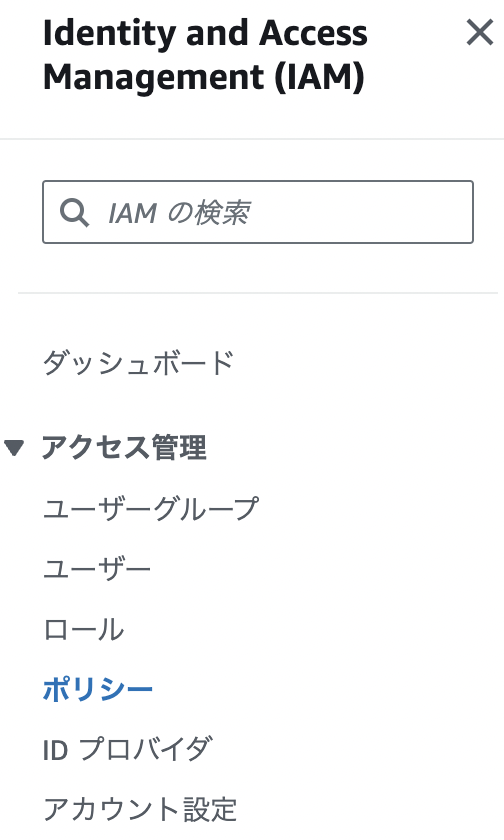
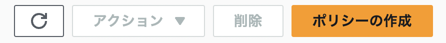
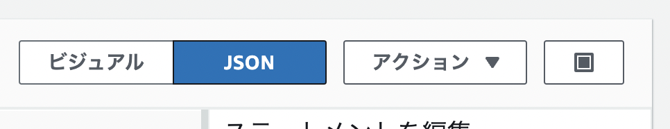
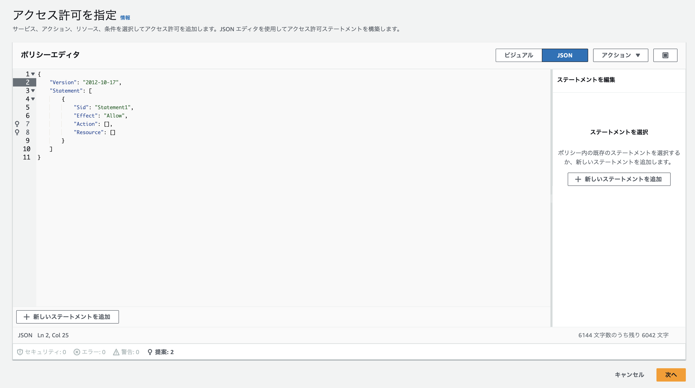
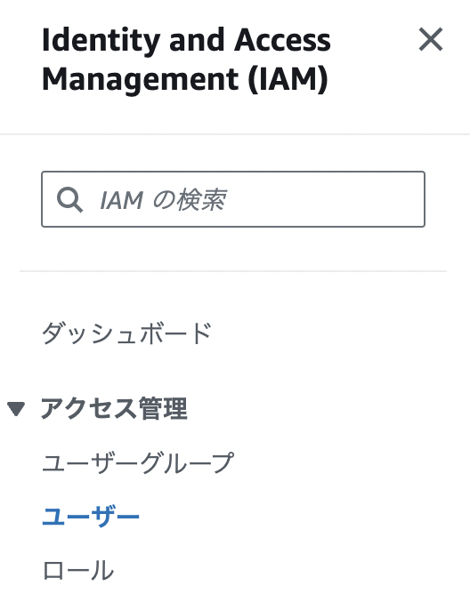
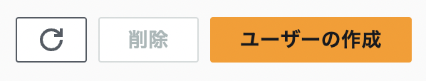
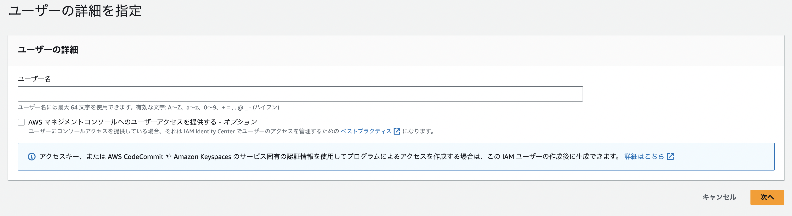
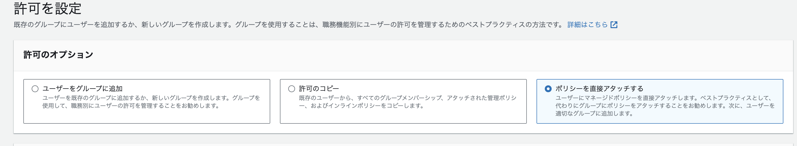
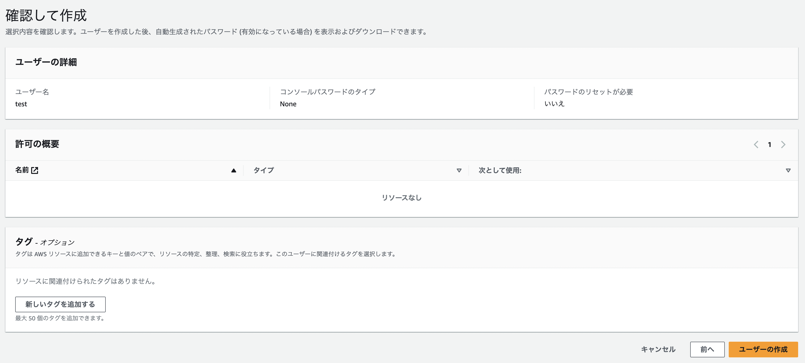

# AWS環境構築（初回）手順書
## 概要
このドキュメントはAWSに対する、環境ごとの初回のインフラ構築手順を示します。  

## ワークフロー
環境構築は以下のワークフローにて実施します。

  1. 事前準備 
  2. インフラ構築用コンテナの起動
  3. Cloud Formationでの構築
  4. SSMパラメータストアの設定
  5. DNSホスティング設定
  6. Terraformでの構築

  <br>
  <br>

## 1. 事前準備

---

### 1.1. ローカル開発環境の構築
下記の手順を参考に、ローカル開発環境を構築してください。

  * [ローカル開発環境の構築](./Documents/10_development/manual/infrastructure/deployment_guide_local/main.md)


### 1.2. 必要ソフトウェアのインストール・機能の有効化
Infrastructure構築用のコンテナの立ち上げに必要な下記のソフトウェアを用意してください。

#### 1.2.1. Windows
WindowsはWSL(Ubuntu) + Docker Desktopを利用します。


* [Docker Desktop](https://www.bing.com/search?qs=HS&pq=Docker&sk=CSYN1&sc=13-6&pglt=2083&q=docker+desktop&cvid=02fa67f8ea97404aa3325ef6f3b5e920&gs_lcrp=EgRlZGdlKgcIABAAGPkHMgcIABAAGPkHMgYIARBFGDkyBggCEAAYQDIGCAMQRRg7MgYIBBAAGEAyBggFEAAYQDIGCAYQABhAMgYIBxBFGDwyBggIEEUYPNIBCDEyMzRqMGoxqAIIsAIB&FORM=ANNTA1&PC=U531)のインストール

* [WSL](https://learn.microsoft.com/ja-jp/windows/wsl/install)の有効化
  * Windows11からはWSLをインストールする前提条件として下記のWindowsの機能を有効化する必要があります。
    * Linux 用 Windows サブシステム
    * Hype-V

* [Ubuntu(WSL distribution)]()のインストール

#### 1.2.2. MAC

* [Docker Desktop](https://www.bing.com/search?qs=HS&pq=Docker&sk=CSYN1&sc=13-6&pglt=2083&q=docker+desktop&cvid=02fa67f8ea97404aa3325ef6f3b5e920&gs_lcrp=EgRlZGdlKgcIABAAGPkHMgcIABAAGPkHMgYIARBFGDkyBggCEAAYQDIGCAMQRRg7MgYIBBAAGEAyBggFEAAYQDIGCAYQABhAMgYIBxBFGDwyBggIEEUYPNIBCDEyMzRqMGoxqAIIsAIB&FORM=ANNTA1&PC=U531)のインストール


### 1.2. IAMユーザー・ポリシーの作成
この項目では、AWS環境構築、運用時のデプロイ、バックエンドのコンテナから利用する下記のIAMユーザー・ポリシーを作成します。

  * 表1. IAM Policy
  
    | Name | Description | file
    | :---   | :--- | :---
    | assetcompass-<環境名称>-github-actions-policy | Github Actions実行用ポリシー | infrastructure/manual/iam_policy_file/github_actions.json
    | assetcompass-<環境名称>-ses-sender-policy     | Rails メール送付用ポリシー   | infrastructure/manual/iam_policy_file/ses_sender.json

    <br>

  * 表2. IAM User
    
    | Name           | Policy | Description
    | :---           | :---   | :---
    | assetcompass-<環境名称>-github-actions | assetcompass-<環境名称>-github-actions-policy | Github Actions実行用ユーザー
    | assetcompass-<環境名称>-ses-sender     | assetcompass-<環境名称>-ses-sender-policy     | Rails メール送付用ユーザー
     
      * 環境名称はproduction / staging / test のいずれか
    <br>

#### 1.2.1. IAMポリシー
以降の手順では、上記「表１. IAM Policy」の内容に従い、繰り返し実施してください。

1. AWSのルートアカウントからAWSコンソールへアクセスします。

2. [IAMのホーム](https://us-east-1.console.aws.amazon.com/iam/home?region=ap-northeast-1#/home)にアクセスします。

3. 左ペインから、「アクセス管理」-「ポリシー」の順に開きます。

     
   
    <br>


4. 中央ペインの右上にある、「ポリシーの作成」ボタンをクリックします。

     
    
    <br>


5. 「アクセス許可を指定」画面が表示されます。ポリシーエディタの右側から、「JSON」を選択します。

     
    
    <br>

6. エディタ編集部分に、「表１. IAM Policy」にて示したIAMポリシーの「file」の内容をコピー＆ペーストし、「次へ」ボタンをクリックしてください。

     
    
    <br>

7. 「確認して作成」画面が表示されます。「ポリシー名」項目に「表１. IAM Policy」にて示したIAMポリシーの「Name」の内容を記載し、「ポリシーの作成」ボタンをクリックします。

    <br>

#### 1.2.2. IAMポリシー
以降の手順では、上記「表2. IAM User」の内容に従い、繰り返し実施してください。

1. AWSのルートアカウントからAWSコンソールへアクセスします。

2. [IAMのホーム](https://us-east-1.console.aws.amazon.com/iam/home?region=ap-northeast-1#/home)にアクセスします。

3. 左ペインから、「アクセス管理」-「ユーザー」の順に開きます。

     
   
    <br>

4. 中央ペインの右上にある、「ユーザーの作成」ボタンをクリックします。

     
    
    <br>

5. 「ユーザーの詳細を指定」画面が表示されます。「表2. IAM User」にて示したIAMユーザーの「Name」を参照し、「ユーザー名」項目に記載し、「次へ」ボタンを押下します。

     

    <br>

6. 「許可を指定」画面が表示されます。「ポリシーを直接アタッチする」を選択し、「表2. IAM User」にて示したIAMユーザーの「Policy」を参照し、該当するポリシーを選択してください。

     

    <br>

7. 「確認して作成」画面が表示されます。設定が正しいことを確認し、「ユーザーの作成」ボタンを押下します。

     

    <br>

8. ユーザーの一覧に戻ります。作成したユーザーを選択し、「アクセスキーを作成」リンクからアクセスキーを作成してください。

<br>
<br>

## 2. インフラ構築用コンテナの起動
### 2.1. 概要
この項目では、以降の作業をするにあたって、必要となるインフラ構築用のdockerコンテナを作成します。

### 2.1. インフラ構築用コンテナの起動

1. イメージのビルド

    プロジェクトルートにて、下記のコマンドを実行し、イメージをビルドします。

    ```bash
    docker-compose -f docker-compose-infrastructure.yml build
    ```

2. コンテナセットの起動
  
    プロジェクトルートにて、下記のコマンドを実行し、実行環境を起動させます。（-d オプションはバックグラウンド実行）

    ```bash
    docker-compose -f docker-compose-infrastructure.yml up -d 
    ```
    
    infrastructureコンテナが起動できていることを確認します。

    * コンテナを確認

      ```bash 
      docker ps -a
      ```

    * 下記のように「assetcompass_infrastructure」のSTATUSがUPであること

      ```bash
      parallels@ubuntu-linux-20-04-desktop:/media/psf/AssetCompass$ docker ps -a 
      CONTAINER ID  IMAGE  COMMAND CREATED STATUS PORTS NAMES
      0738ebbe2958   assetcompass_infrastructure   "entrypoint.sh /usr/…"   3 minutes ago   Up 3 minutes                                                                               assetcompass_infrastructure
      ```

    <br>
    <br>
    
## 2. インフラ構築環境へのログイン
### 2.1. 概要
この項目では、前項で構築したインフラ実行環境へログインし、構築したい環境情報（production / stagin / test）に応じた環境変数を設定します。


### 2.2. インフラ実行環境へのログイン

1. ログイン

    プロジェクトルートより、下記のコマンドを実行しインフラ実行環境へログインしてください。

    ```bash 
    docker exec -it assetcompass_infrastructure /bin/bash
    ```

### 2.3. 環境変数の設定

1. システム環境変数の設定
  
   次のシェルを実行し、システム環境変数を設定します。環境名称にはのいずれかを入力してください。c

    ```bash
    source /usr/bin/set_env.sh <環境名称>
    ```
    
    <br>
    <br>

## 3. Cloud Formationでの構築
### 3.1. 概要
この項目では以下のリソースについてCloud Formationを用いて構築を行います。<br>
コア部分のインフラは保守性の面から後述のTerraformで実行します。


* AWS Resource Group
  * 本プロジェクトのリソース判別ができるようリソースグループを設定します。
* AWS S3
  * Terraform tfstate格納用バケットです。
* AWS DynamoDB
  * Terrafom でのコンフリクト管理用のDBです。
* System Manager
  * Secret情報を格納するためにSSMを事前に用意します。
* Route53
  * Route53は事前に設定するようにします。


### 3.2. 実行手順

1. カレントディレクトリの移動

    以下のコマンドを実行し、カレントディレクトリをスタックテンプレートのあるディレクトリに移動します。

    ```bash
    cd $INFRASTRUCTURE_HOME/cloudformation
    ```

2. Cloud Formationの実行

   以下のコマンドを実行し、Cloud Formationを実行してください。

   ```bash
   aws cloudformation create-stack \
   --stack-name $STACK_NAME \
   --template-body $STACK_TEMPLATE \
   --parameters \
   ParameterKey='SystemName',ParameterValue=$SYSTEM_NAME \
   ParameterKey='SystemDomain',ParameterValue=$SYSTEM_DOMAIN \
   ParameterKey='SystemEnv',ParameterValue=$SYSTEM_ENV

   ```

   実行後、下記のような出力があり、Cloud Formation のStack IDが表示されます。
   こちらのIDをを控えておいてください。（次点の確認事項で必要となります。）


    ```bash 
    {
     "StackId": "arn:aws:cloudformation:ap-northeast-1:<AWS Acoount ID>:stack/production-asset-compass-terraform-preparation/85fe5260-35e3-11ef-8966-06fa51718c71"
    }

    ```

3. Cloud Formation 実行スタックが正しく完了しているかの確認

   以下のコマンドを実行し、先程実行したスタックが正しく完了していることを確認してください。

    ```bash 
    aws cloudformation list-stacks
    ```

    「StackStatus」が「CREATE_COMPLETE」になっていれば正常に完了しています。

    異常がある場合はAWS Consoleから確認してください。

    <br>
    <br>


## 4. SSM パラメータストアの設定
### 4.1. 概要

* 特定のパラメータは、コード上で管理した際の漏洩リスクを防ぐため、SSMパラメータをAWSコンソール上から登録を行います。

### 4.2. SSM パラメータストアの設定

1. Secret ManagerへのSecretの値の登録

   前項で作成したSecretManagerに対してSecret情報を登録します。AWSコンソールから下記の操作を行います。

  [SecretManagerのサービスページ](https://ap-northeast-1.console.aws.amazon.com/secretsmanager/landing?region=ap-northeast-1)を開きます。

3. 「Secretの値」項目から、「シークレットの値を取得する」-「編集する」の順にクリックします。下記の値について、[詳細設計書_SSMパラメータ](https://docs.google.com/spreadsheets/d/1OP54d84G8004fwKeE9H4dF1Dv75jsobbxuJGDlTybpI/edit?usp=sharing)を参照し、設定してください。

    | パラメータ名 | 
    | :---- |
    | /asset-compass/<環境名称>/db_password
    | /asset-compass/<環境名称>/db_port
    | /asset-compass/<環境名称>/db_user

    登録する値は[環境変数の一覧]()より確認してください。

    <br>
    <br>

## 5. イメージの作成とECRプッシュ
### 5.1 概要
この項目では、前項で作成したECRリポジトリに対し、BackendイメージをPUSHします。

### 5.3. イメージの作成とECRプッシュ

1. カレントディレクトリの移動

    以下のコマンドを実行し、Terraform実行ディレクトリへ移動します。

   ```bash
   cd /asset_compass
   ```

2. イメージの作成とECRプッシュ
  
   次のシェルを実行し、Cloud Formationで作成したECRにイメージをプッシュします。
   環境名称にはproduction / staging / testのいずれかを入力してください。

    ```bash
    /usr/bin/image_push.sh
    ```
    
    <br>
    <br>

## 6. Terraform初期化
### 6.1. 概要

* この項目ではTerraformにより、下記の項目を構築します。
  * VPC
  * Internet gatewayv


<br>

### 6.2. Terraformの初期化

1. カレントディレクトリの移動

    以下のコマンドを実行し、Terraform実行ディレクトリへ移動します。

   ```bash
   cd $INFRASTRUCTURE_HOME/terraform/environments/$SYSTEM_ENV/
   ```

2. Terraform initの実行

    以下のコマンドを実行し、Terraformの初期化を実行してください。

    ```bash 
    terraform init \
    -backend-config="bucket=${BUCKET_NAME}" \
    -backend-config="key=terraform.tfstate" \
    -backend-config="region=${SYSTEM_REGION}" \
    -backend-config="encrypt=false" \
    -backend-config="dynamodb_table=${LOCK_TABLE}"

    ```

### 6.3. Terraformの初期化

1. メインコンポーネントのApply

   前項でSecretが登録されたので、メインコンポーネントをApplyします。次のコマンドを実行してください。

   ```bash 
   # Plan 
   terraform plan

   # Apply 
   terraform apply
   ```

   <br>
   <br>

## 7. S3バケットポリシーの設定

### 7.1. 概要
この項目では、S3バケットポリシーを手動で設定します。

※!!! Terraformで適用しようとしたところ、[エラー](/Documents/issue/s3_bucket_policy.md)がでたため、今回は手動で設定している。


### 7.2. S3バケットポリシーの設定

1. AWSコンソールよりS3ホームを開きます。

2. asset-compass-<環境名称>-frontを開き、「アクセス許可」タブを開き、「バケットポリシー」項目にて編集ボタンから下記内容で保存します。

	``` bash 
	{
		"Version": "2012-10-17",
		"Statement": [
			{
					"Effect": "Allow",
					"Principal": "*",
					"Action": "s3:GetObject",
					"Resource": "arn:aws:s3:::asset-compass-production-front/*"
			}
		]
	}
	```

	<br>
	<br>

## 8. フロントエンドのビルド・アップロード
### 8.1. 概要
本項目では、フロントエンドのコードのビルド・S3へのアップロードを実行します。

### 8.2. フロントエンドのビルド
この手順はコンテナホスト上で実施します。

1. yarn generateの実行

	下記のコマンドを実行し、フロントエンドのnuxtプロジェクトをビルドします。

	```bash 
	docker exec -it assetcompass_frontend_1 yarn generate
	```


### 8.3. ビルドコンテンツのアップロード

1. ログイン

    プロジェクトルートより、下記のコマンドを実行しインフラ実行環境へログインしてください。

    ```bash 
    docker exec -it assetcompass_infrastructure_1 /bin/bash
    ```

2. ビルドコンテンツのアップロード
  
   インフラ実行環境で下記のコマンドを実行し、ビルドコンテンツをアップロードします。

    ```bash
    aws s3 sync /asset_compass/FrontEnd/.output/public s3://asset-compass-production-web-host --delete
    ```


[READMEトップに戻る](../../../../../README.md)
